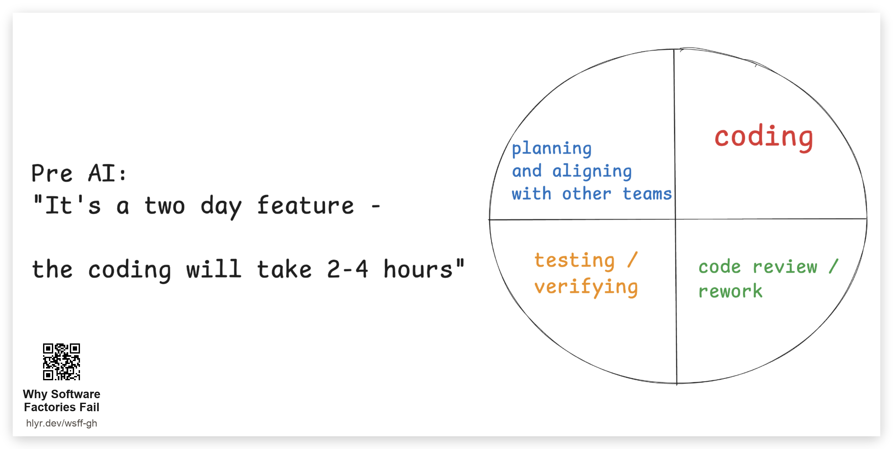
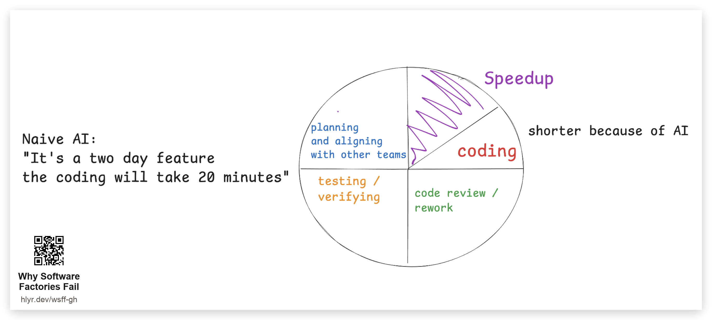
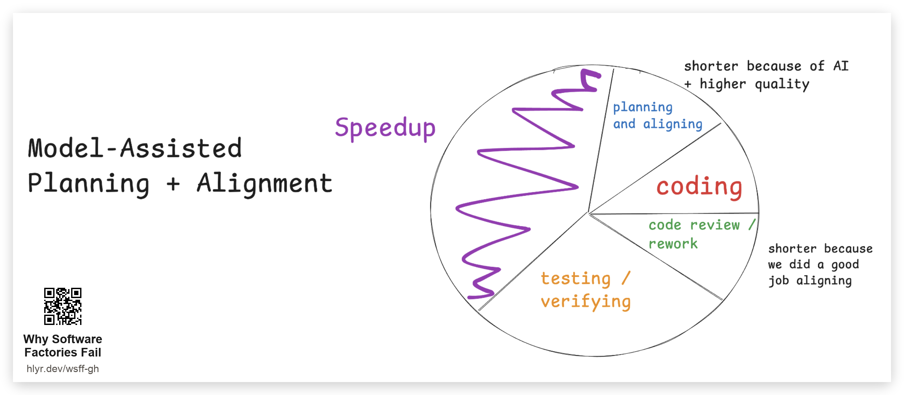
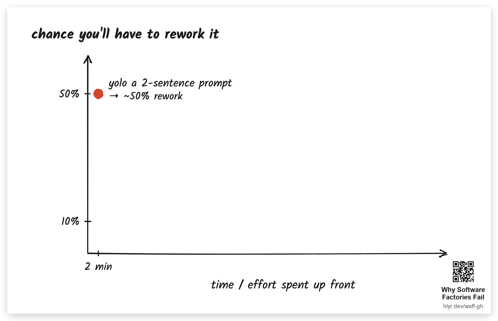
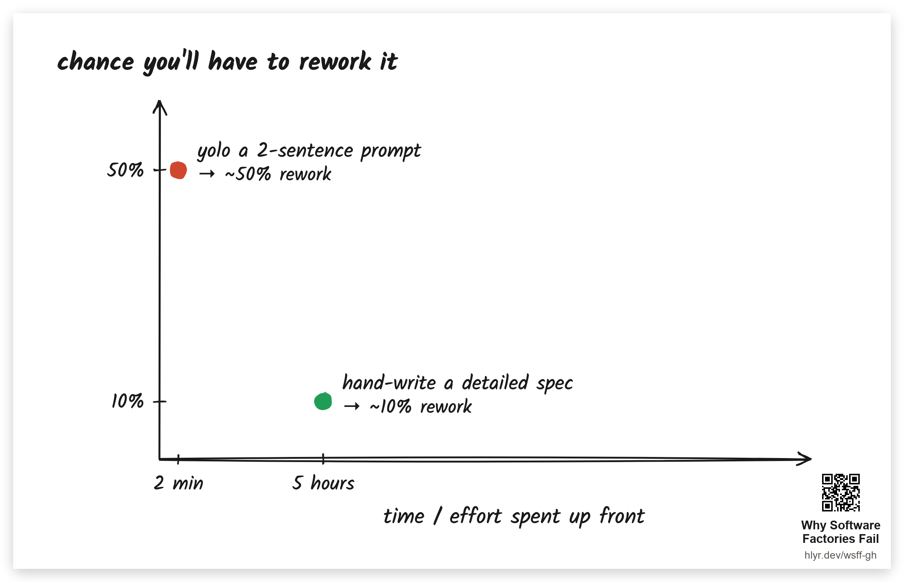
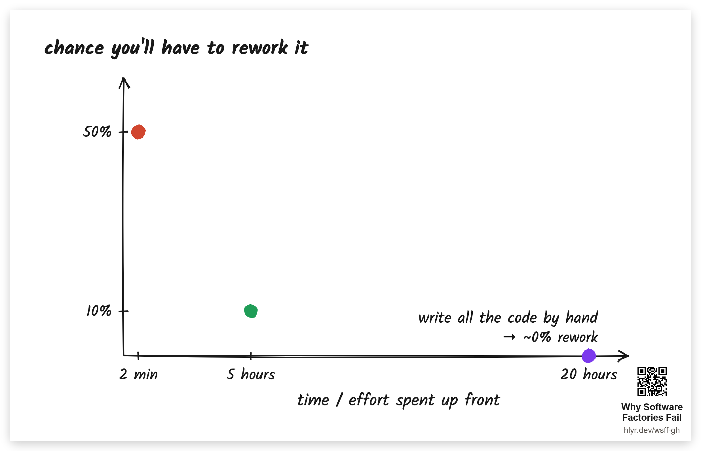
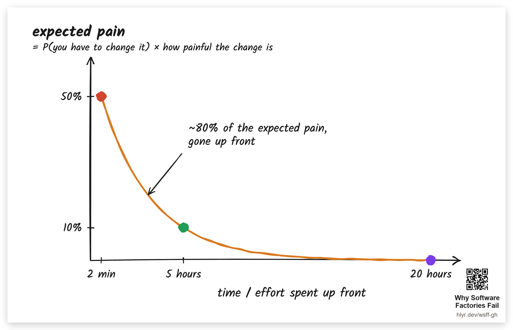

# Where does the time go

_A side quest carved out of [Why Software Factories Fail](https://github.com/humanlayer/advanced-context-engineering-for-coding-agents/blob/main/wsff.md)_

Even before AI, only 25-50% of the time to ship a feature was writing the code itself. The rest was aligning/planning, code-review/rework, and testing/verifying the solution.

If you're only using AI to write the code, then you're taking the 2-4 hours of coding time down to 10-20 minutes, but you haven't accelerated anything else here.

But if you use AI to help you plan and align, then you actually get closer to 2-3x faster. 

### The 80/20 rule in AI coding leverage

Lets assume if you yolo a two-sentence prompt into your factory, your chance of getting a fully-mergeable result is ~50%, the chance you have to rework it is 50%.

Now lets say you are a principal engineer with 10 years of experience. You have the whole codebase across 100 repos downloaded into your head. So you spend an afternoon writing a perfectly detailed spec by hand. Now your odds are better, but you probably still have about a 10% chance that you'll have to redo *something* significant.

And at the far end: write every line yourself. Nothing's left for the agent to get wrong, so the rework chance goes to zero.

**note** For this example I'm gonna blur "chance you'll have to change something" x "how painful the change will be" into a single %age number but obviously they're two separate variables. If the model is 50% likely to get a button style wrong, but the fix is one cheap prompt, then our combined "expected pain" is low.

$$\text{expected pain} = P(\text{you'll have to change it}) \times \text{how painful the change is}$$

If you draw this out, there's an inverse relationship between effort invested up front and expected pain.

What you don't want to do is spend 6 hours planning a task for which you could have eliminated 80% of the expected pain in the first 10 minutes.
