# Why Software Factories Fail

_or: harness engineering is not enough_

> [!NOTE]
> I run a company ([HumanLayer](https://humanlayer.com)) building tools in the human/agent collaboration space, so what I'm gonna say below may be a tad biased. Perhaps in spite of that, I hope you find the subject helpful or at the very least that you find it as interesting as I do. -Dex

## i guess we doin loops now

We're all racing to put AI coding into production. A lot has been said about loop engineering, and the prevailing wisdom is that we should probably write more loops.[^1] 

<div align="center">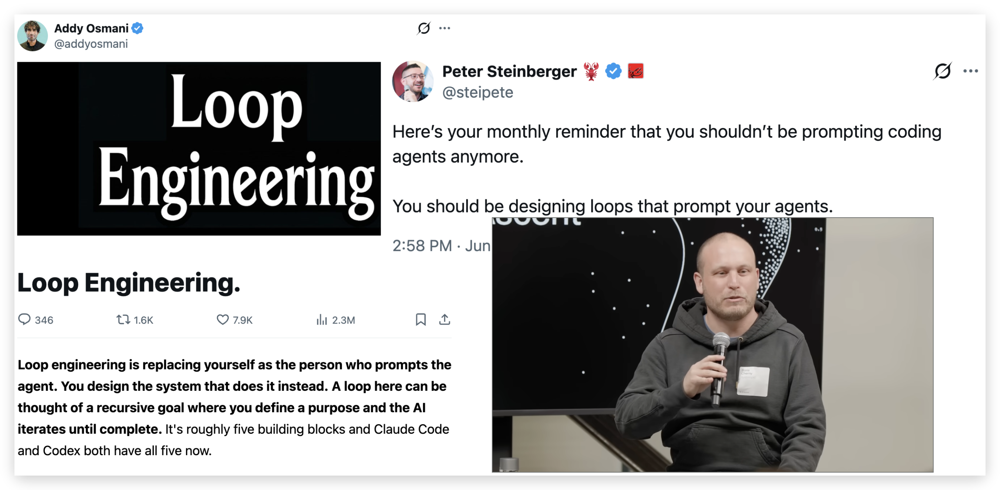</div>

[StrongDM wrote about their lights-off software factory](https://factory.strongdm.ai) where no human reads code and no human writes code.

The narrative goes something like this:

1. You are the bottleneck. 
2. The models are good enough. 
3. Code is free. 
4. Just ship more stuff.

[Ryan Lopopolo](https://x.com/_lopopolo) of OpenAI [wrote about this in February](https://openai.com/index/harness-engineering/) and [gave a talk in April](https://www.youtube.com/watch?v=am_oeAoUhew) about OpenAI's software factory, Symphony. 

<div align="center">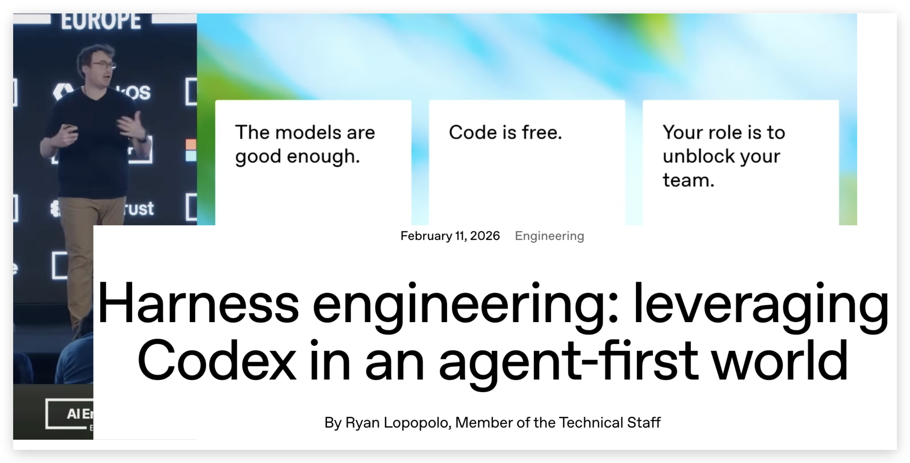</div>

These people are all really dang smart and I have a ton of respect for them. But the most cynical take here would be to call this yet another excuse to pump more VC money into the slop cannon. 

### it's uh...it's going

Our friend [Mario](https://x.com/badlogicgames) got up at AI Engineer Europe and [begged us to slow down](https://www.youtube.com/watch?v=RjfbvDXpFls) -- because companies that have no business having outages due to coding-agent mishaps, are, well... [having outages due to coding-agent mishaps](https://www.ft.com/content/00c282de-ed14-4acd-a948-bc8d6bdb339d).

As [Matt Pocock](https://x.com/mattpocockuk) put it, [codebases are falling apart faster than they ever have before](https://www.youtube.com/watch?v=3MP8D-mdheA). 

I haven't been able to dig up any definitive data/findings from StrongDM on how that whole dark factory went. The [weather-report](https://factory.strongdm.ai/weather-report) has a few sparse updates between February and June of this year.

[The folks at Faros AI](https://www.faros.ai/research/ai-acceleration-whiplash) put out a report: since we[^1b] all picked up these AI coding tools back in January and February, pull-request review quality is way down. 

* More comments, longer comments, and tons of PRs getting merged with no review at all. 
* Incidents are way up. 
* Bugs per developer are way up.

| 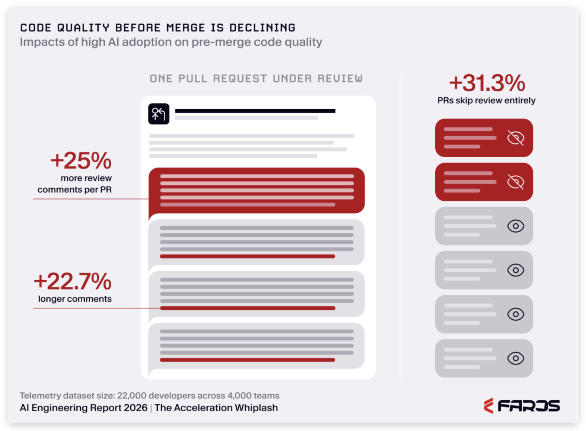 | 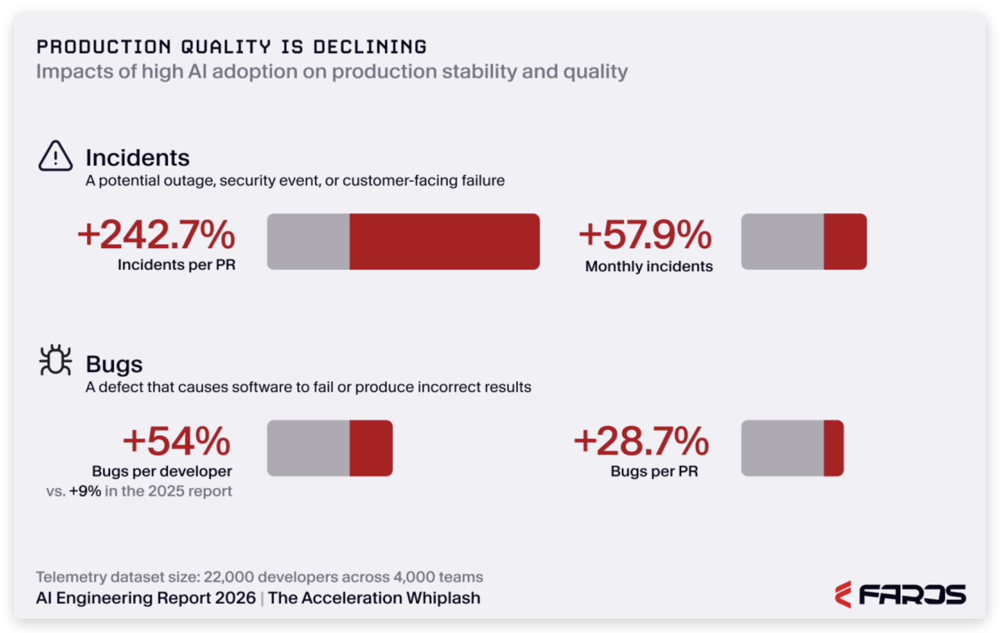 |
|---|---|


This report is more of a correlation signal than a verifiable smoking gun[^6], and the whole point of this post is to be wary of slop data, but it *feels* directionally valid based on what I've seen.

### "You're holding it wrong" (you're not)

A lot of people will tell you that this is a skill issue -- that if you're not getting good results, that's your fault.

But however you're choosing to...erhm...hold it, I guarantee you're being told that if token-maxxing isn't working for you, it's a skill issue. You just need to spend more tokens. Let go of reading the code. And if you're just getting there, I promise it's part of the progression. [I thought this way last summer too](https://hlyr.dev/ace).

Unfortunately for my ego, some dumb stuff I decided to say about "how to hold it better" got recorded and now has about a million cumulative views on YouTube. I am not trying to brag here, I share this only to establish that I've been going deep on the best ways to use coding agents for a **long time** now, and have discovered some things that many others have found **genuinely useful**.

| [](https://hlyr.dev/ace) | [](https://hlyr.dev/nva) | [](https://hlyr.dev/qrspi-mlops) |
|---|---|---|
| [Advanced Context Engineering for Coding Agents](https://hlyr.dev/ace) | [No Vibes Allowed -- Solving Hard Problems in Complex Codebases](https://hlyr.dev/nva) | [Everything We Got Wrong About RPI](https://hlyr.dev/qrspi-mlops) |

Anyhow, **The promise** of all this online "just token harder" yapping we've been forced to endure is, succinctly: with enough harness engineering, we can get the best of both worlds: 

- 10 to 100x faster,
- high quality, and 
- nobody ever has to do that thing we all hate called code review

All we have to do is configure more linters and sprinkle some magic words like "adversarial review" onto enough PR review bots, and our software will happily build itself without incident.

## This is not a skill issue

What I'm gonna try to convince you is that no amount of harness engineering or loopsmaxxing can solve what is fundamentally a model-training issue.

To grapple with this, I had to dig into how coding models are actually trained and evaluated - with respect to both the [RLVR](https://github.com/opendilab/awesome-RLVR) and the benchmark side of things. 

In this post I'm gonna run through:

1. Software factories date back to 1968, how have they evolved, and how has AI changed them
2. Why models can generate mountains of slop despite ace-ing benchmarks (even the brand new "frontier" benchmarks)
4. **In spite of this**, you can move pretty fast without setting your codebase on fire

I'm gonna try to cut through the hype of every daily-emerging skills plugin and the ai-psychosis-tokenmaxxing advice pandemic, and talk in general terms about the **types of things that work** without referencing any particular skill or framework.

**Video Version:** this post is based on (and expands upon) [my keynote at AI Engineer World's Fair 2026](https://www.youtube.com/watch?v=Ib5GBkD555M).

_Thanks to [@addyosmani](https://x.com/addyosmani), [@CyrusNewDay](https://x.com/CyrusNewDay), [@HamelHusain](https://x.com/HamelHusain), [@zeeg](https://x.com/zeeg), [@dillon_mulroy](https://x.com/dillon_mulroy), [@nayshins](https://x.com/nayshins), and [@jeffreyhuber](https://x.com/jeffreyhuber) for feedback on this post._

## An aside: this has nothing to do with vibe coding

[Addy Osmani](https://x.com/addyosmani/status/2066595308629594363) detangled this thing that is worth highlighting:

<blockquote align="center"><h3>A developer vibe-coding a side project a dozen people will ever run, and a team keeping a ten-year-old enterprise system alive for another quarter, share almost no constraints worth naming, and most of the advice in circulation is really one of those two people telling the other how to live.</h3></blockquote>

If you love vibe coding, please, go on vibing. I still vibe code lots of things, I just *also* maintain lots of production software (and through HumanLayer, help 1000s of other engineers do the same), so the rest of this is aimed at folks solving hard problems in complex codebases.

I hear the word **brownfield** a lot to talk about this split. Historically that meant some ten-year-old Java thing, but at the pace we can ship now, it feels like an agent-built codebase starts to struggle after maybe **three to six months** -- you start to slow down, and the way you approach adding new things has to change.

## A brief history of the software factory

I've been building and studying software factories my whole career, but I only learned this recently: the term traces all the way back to a [NATO conference in 1968](http://homepages.cs.ncl.ac.uk/brian.randell/NATO/nato1968.PDF) -- the same one that gave us "software engineering."

The only other bit I find super interesting since then is that the [US Department of Defense wrote a 31-page pdf about how the DoD needs to start using jenkins better or something](https://dodcio.defense.gov/Portals/0/Documents/Library/DevSecOpsReferenceDesign.pdf).

### The 2022 software factory

Let's ground our "software factory" definition around 2022, right before AI. In a typical software factory:

- **People decide what to build** -- engineers, PMs, leadership driving the vision
- **It goes in a tracker** -- Linear, Jira, whatever: a state machine of what needs to happen
- **Someone grabs a ticket and builds it** -- probably does some manual/automated testing while they're at it
- **Pull request** -- automated checks, a human reviews the code, maybe someone pulls it down to test
- **Anything wrong? Loop back** to "someone builds the thing"
- **Ship to prod** -- and it makes contact with users
- **Add monitoring** -- there's an entire industry built around paging an engineer at 3am when something breaks
- **Users complain** -- ask for things, find bugs, file feature requests → back to the team to add to the tracker

https://github.com/user-attachments/assets/7bf8f42d-f13b-40c3-a8a2-7dca509f2d38

And on and on. We haven't even hit AI yet, and there are already several loops in this picture.

### front-loading alignment

The thing teams figured out decades ago: building takes hours or days, and so does review. 

<div align="center">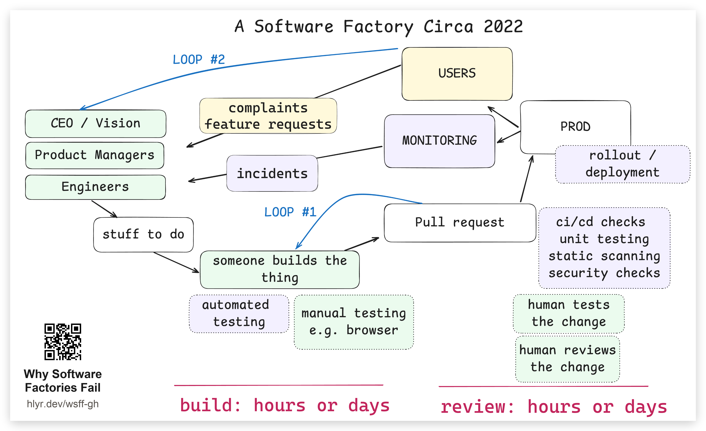</div>

So we front-load the work -- planning, architecture proposals, sprint planning -- together, as a team. That means:

- **less rework**, because we aligned before anyone wrote code
- **less time reviewing every line**, if you've ever read a long-but-well-done PR, you know how fast the review goes when it's close-to-perfect

<div align="center">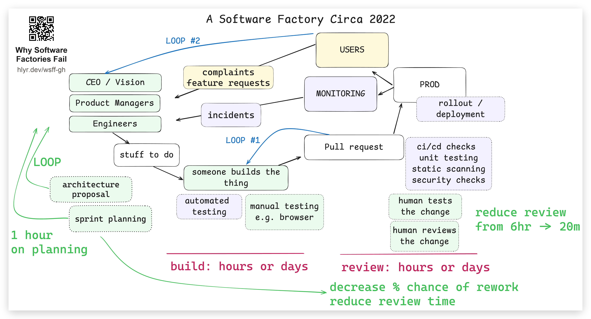</div>

We'll come back to this later - let's look at what happens when you bring agentic coding into the picture.

### The agentic software factory

Now every company and their mother -- 
- [Ramp](https://infoq.com/news/2026/01/ramp-coding-agent-platform/)
- [Stripe](https://stripe.dev/blog/minions-stripes-one-shot-end-to-end-coding-agents)
- [WorkOS](https://workos.com/blog/project-horizon)
- [Brex](https://www.latent.space/p/brex) 

has spent the better part of this year explaining how they built an agent factory that ships on the order of **75% of their code**. 

The agentic factory looks mostly like swapping **"someone builds the thing" → "an agent builds the thing"** -- there's some stuff here like orchestration, a harness, a sandbox, a model, computer use, etc. I won't go in depth on those details because quite frankly I'm sick of reading about it and I'm sure you are too.

<div align="center">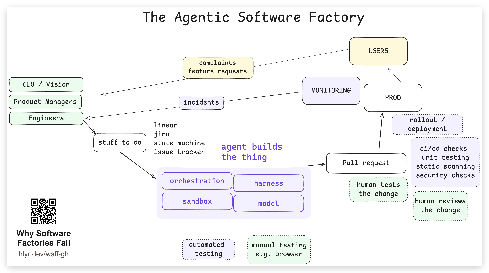</div>

When the agent builds the thing:

- Building drops from hours or days to minutes or hours.
- Review still takes hours or days. A human still has to read the code and test the change. So review is now the bottleneck.

<div align="center">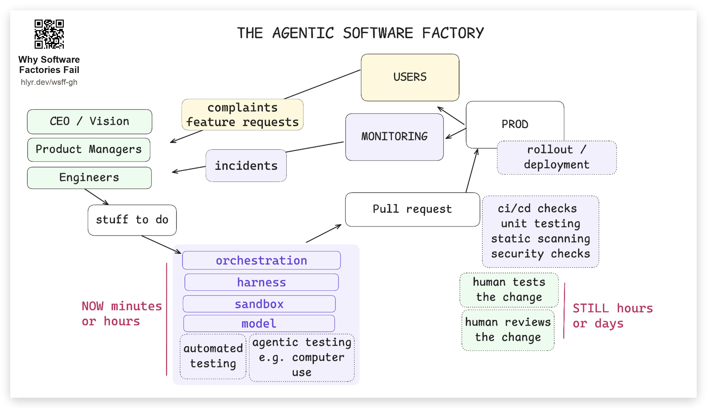</div>

So you speed review up too:

- Agentic code review, to catch style, bugs, security.
- Agentic regression testing, to poke it from the outside with browsers and computer use and maybe send you a cute little video when it's done

<div align="center">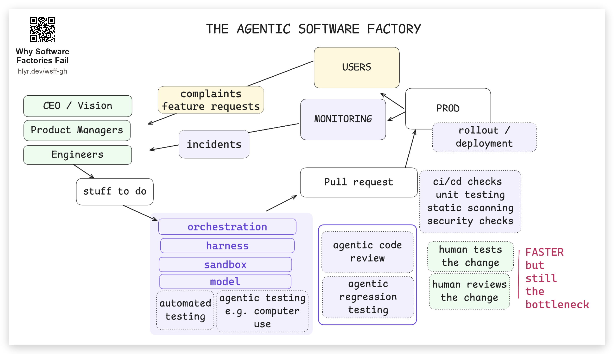</div>

Review is faster now, but it's also probably still the bottleneck. But we can do more loops.

Next you might route incidents into the factory. Instead of paging someone at 3am, they wake up to a PR that maybe already fixes it.

<div align="center">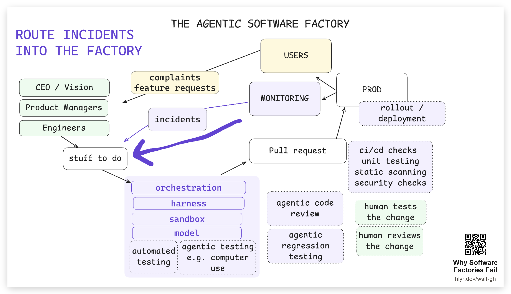</div>

We can also route user feedback into the factory. People ask for stuff, it gets built.

<div align="center">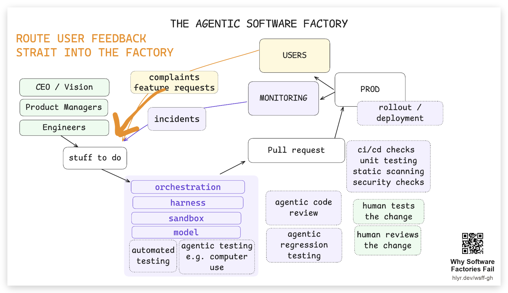</div>

At which point the job is two questions: how much can you stuff into the queue, and how fast can you review and test what comes out?

<div align="center">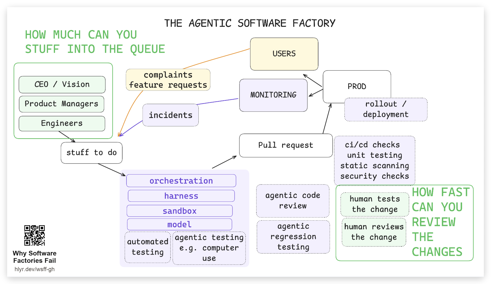</div>

Which brings us to the lights-off software factory.

### The lights-off software factory

[Dan Shapiro coined this term](https://www.danshapiro.com/blog/2026/01/the-five-levels-from-spicy-autocomplete-to-the-software-factory/) and [Simon Willison wrote about StrongDM's implementation of it](https://simonwillison.net/2026/Feb/7/software-factory/) -- where we no longer read the code. 

You look at your beautiful software factory. It's ruined by that annoying little code review step and you say: you know what, that thing where a human reads every change? No thanks.

<div align="center">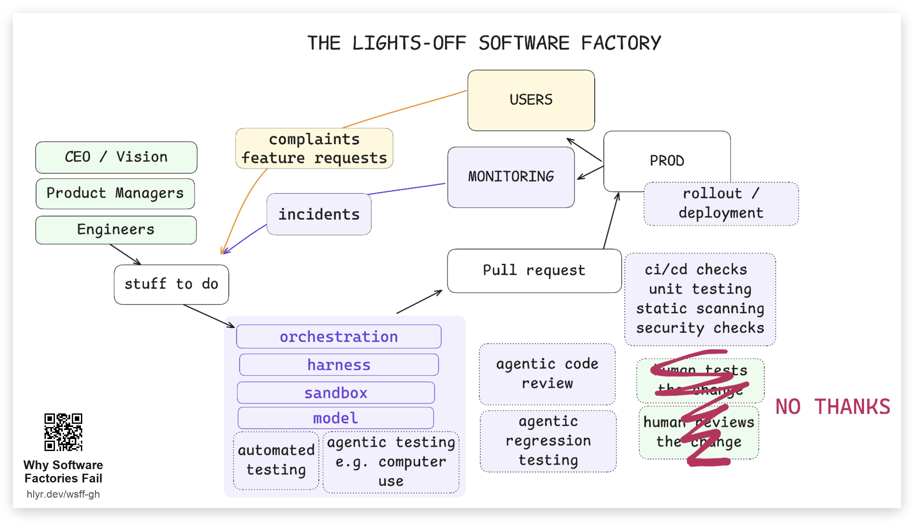</div>

So you drop it, and you put the effort somewhere else:

- Invest in testing and letting the agent test its own work
- Invest in sandboxes and orchestration
- Invest in automated review
- Invest in monitoring
- Invest in rollout
- Invest in collecting feedback signals from users

<div align="center">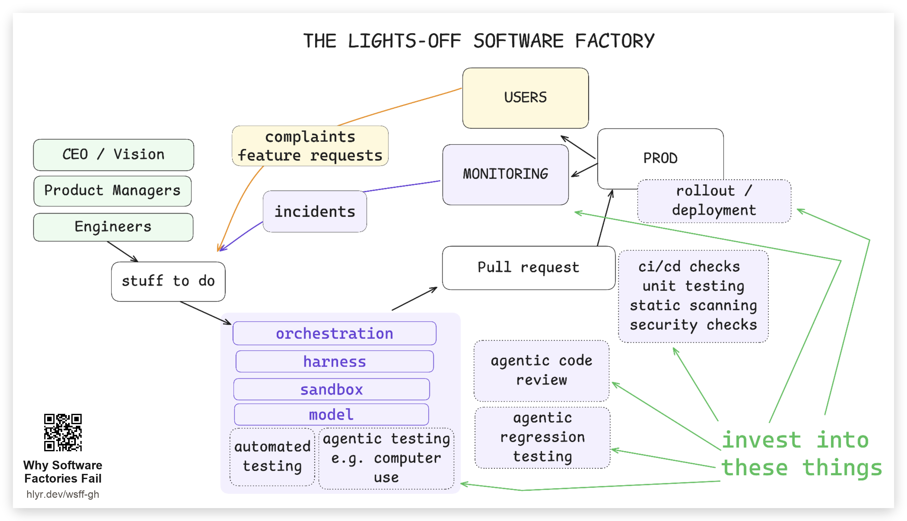</div>

And now the job really is just one question: how much stuff can we ask the agent to build? How much of the [ocean do we want to boil](https://garryslist.org/posts/boil-the-ocean)?

<div align="center">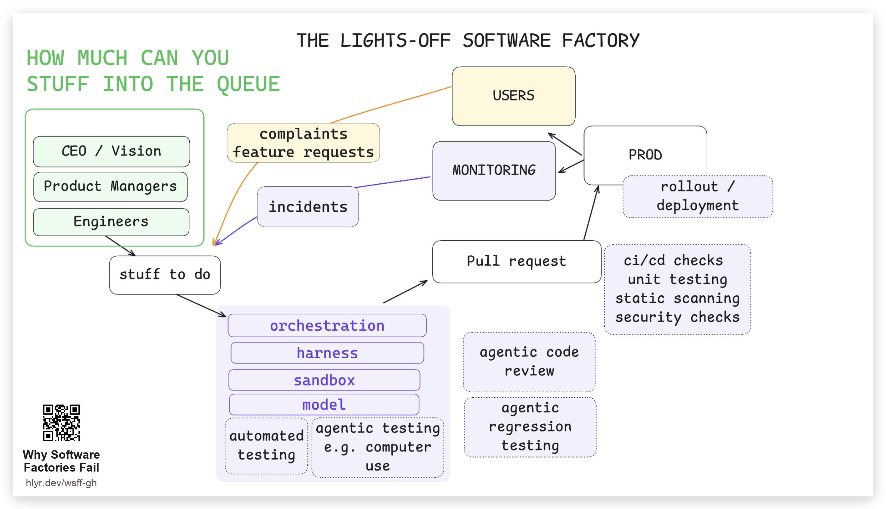</div>


## This is going to go great (its not)

I'm going to posit something potentially controversial: the lights off factory does not work.

Let's get into why software factories fail.

## We tried this 

In July 2025 we went full lights-off. Just read the specs and the tickets, background agents for all the small/medium stuff, the whole thing.

If you've tried this seriously for a few months, you already know how it ends. You find at least one issue gnarly enough that the agent can't solve it -- even with your most advanced prompting and workflows.

- You do deep context-aware research, collating all the right parts into the smart zone for the model to analyze
- You have the agent try to reproduce in 10 different ways

Eventually you have to suck it up and go dig into the codebase you stopped reading three months ago, trying to figure out what's broken.

And in the meantime:

- Your site was down.
- Your users were pissed.
- And you, if you're anything like me, were miserable -- reading all the slop code you let slip into your system.

The first time this happened to us, I shook it off. Even though I'd just spent the better part of two weeks digging through claude spaghetti, "the downside risk was worth the velocity". By the ~third time in november, we decided it would be easier to rewrite from scratch, and my cofounder spent **two whole weeks** in VS Code (not even cursor) plumbing out all the patterns by hand.

## models degrade codebase quality over time

What I want to get to is this: models have a shortcoming. They can't maintain and improve codebase quality over time -- not without a decent amount of human steering.[^3]

When I say maintainability, I mean the specific thing where it becomes really, really hard to change one part of the codebase without breaking another part. This is [Martin Fowler's shotgun surgery](https://refactoring.guru/smells/shotgun-surgery).

I'm not going to say much more about maintainability. There are a bunch of books you can go read about it 

- [John Ousterhout's _A Philosophy of Software Design_](https://web.stanford.edu/~ouster/cgi-bin/aposd.php)
- [Robert C. Martin's _Clean Code_](https://www.oreilly.com/library/view/clean-code-a/9780136083238/)
- [Martin Fowler's _Refactoring_](https://martinfowler.com/books/refactoring.html)

So, why *can't* models do software maintainability?

### "But surely the models have gotten better since then"

At this point you might be dying to say: *but Dex, surely the models have gotten much better since July*

They have -- in some ways. In others they're about the same.

- Solving one-off problems, or vibe-coding a new marketing site? Yes. Way better.
- Improving codebase quality over time? Not much better, as far as I can tell.

<div align="center">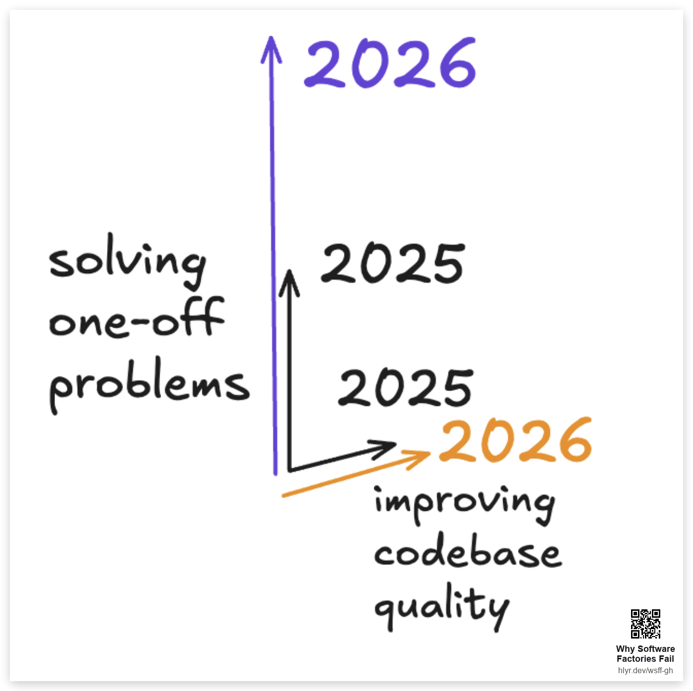</div>

I can't prove this. You can't prove it either. There are no good benchmarks for a model's ability to maintain codebase quality. (More on where that's going later.)

<blockquote align="center"><h3>THERE ARE NO GOOD BENCHMARKS for a model's ability to maintain codebase quality</h3></blockquote>

But if you've worked with coding agents for a while -- and a lot of people are posting about exactly this -- you probably have the vibe already: they tend to make things worse over time, and make the codebase harder to work in.

So to figure out *why* this happens, I want to zoom out to the first great coding agent.

### Claude Code won because of Reinforcement Learning inside the harness

Claude Code went from nothing to ~$4B -- now something like ~$9B -- in revenue in under a year.

<div align="center">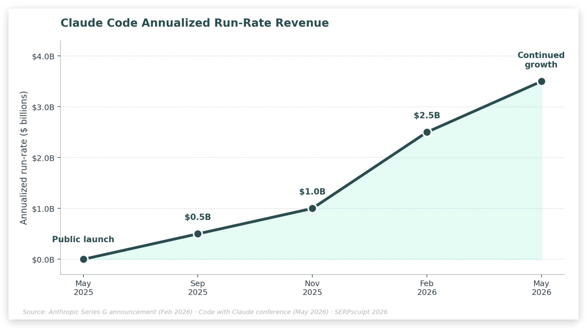</div>

Which is a little wild, because there were already great CLI agents. [aider](https://aider.chat), [cline](https://cline.bot), [codebuff](https://codebuff.com) -- all predated Claude Code, all with genuinely great context engineering built in, all with the same tool set you might attribute to claude code: read, write, edit, grep, bash. I used them. They were good. But also, tool use would just... fail sometimes -- you'd watch it flail at the same edit three times and open your editor back up to do it yourself. 

[The SWE-Agent paper from 2024](https://arxiv.org/abs/2405.15793) outlines how small changes in tool shape make noticeable differences, e.g. including line numbers in ReadFile results, or changing an Edit tool from find/replace to line-range edits.

<div align="center">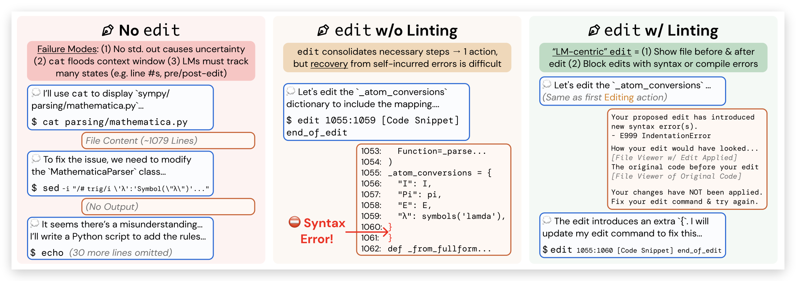</div>

Then Claude Code launched and went vertical pretty quickly. You can hand-wave this as distribution, but the canonically-accepted explanation is that claude code won because it was better, and that it was better because Anthropic RL'd the model **inside the harness** -- the first time a lab trained a model against the exact tools they were going to ship it with. And it got **really, really** good at calling those tools in an agentic loop.

It's one thing to fiddle with tool definitions and evals until you find the shape the model likes best -- I've burned weeks doing this for various use cases. It's a different game when you own the weights and can **modify the model itself** to be better at a particular set of tools.

The OpenAI team [gave a talk in November](https://www.youtube.com/watch?v=wVl6ZjELpBk) that put this pretty well: if you build a harness but you don't own the weights and can't RL the model inside it, you'll always be at a disadvantage to a team that owns both.

### Coding Agent RL in 60 seconds

I did a bunch of research on this topic and cooked up a bunch of visualizations to try to explain the parts that matter, but I found that [Calvin French-Owen's](https://x.com/calvinfo) (MTS on the codex team, founder of Segment) did a talk at [AI Council](https://www.youtube.com/watch?v=q-ntX4DLW_c) that did a much better and cleaner job, so I'm just gonna drop this animation here inspired by his slides:

https://github.com/user-attachments/assets/25c45e29-ebf7-4ce7-9b57-969cdf305e2e

To make a model better at coding, you're gonna:

1. generate some coding agent traces to solve a problem (e.g. fix my tests)
2. score the traces based on some criteria (verifier)
3. update the model weights to make the good traces more likely, and the bad traces less likely

And then you do this millions of times over the course of weeks or months.

The "scoring" part of these things can tend to be whimsically one-dimensional though.

### There's no penalty for bad design

Take [SWE-bench Multilingual](https://huggingface.co/datasets/SWE-bench/SWE-bench_Multilingual). The tasks are small -- about fifteen minutes of work apiece -- scraped out of open-source repos like Redis, jq, and Django. The reward is one or zero based on:

- `FAIL_TO_PASS` - did you fix the thing you were asked to fix?
- `PASS_TO_PASS` - did you do it without breaking anything else?

Here's a real one, `fastlane__fastlane-19304`, from [fastlane](https://github.com/fastlane/fastlane) -- a Ruby project. Its zip action grabs two optional params and calls `.empty?` on them straight away, so the moment you leave `include` and `exclude` off, it falls over:

```
'zip_command': undefined method 'empty?' for nil:NilClass
```

The human fix that closed this particular issue is two lines (default nils to empty arrays):

```diff
# fastlane/lib/fastlane/actions/zip.rb
-      @include = params[:include]
-      @exclude = params[:exclude]
+      @include = params[:include] || []
+      @exclude = params[:exclude] || []
```

During the evaluation, the model 

1. starts from a **base commit** -- the repo checked out to the moment right before that fix landed 
2. the bug report - in this case `'zip_command': undefined method 'empty?' for nil:NilClass`
 

The agent goes off and writes some code based on the issue. It doesn't see the golden patch or the **test patch** that serves as the grader:

```diff
# fastlane/spec/actions_specs/zip_spec.rb
+  it "sets default values for optional include and exclude parameters" do
+    params = { path: "Test.app" }
+    action = Fastlane::Actions::ZipAction::Runner.new(params)
+    expect(action.include).to eq([])
+    expect(action.exclude).to eq([])
+  end
```

Then:

1. We keep whatever patch it produced, then 
2. Throw away any edits it made to the test files (we've caught a model quietly commenting out the failing test or splicing in a mock that makes the test useless) 
3. Apply the benchmark's test patch on top, and 
4. Run the whole suite: the existing zip tests (`PASS_TO_PASS`) plus the new one (`FAIL_TO_PASS`) to see if they both pass

<div align="center">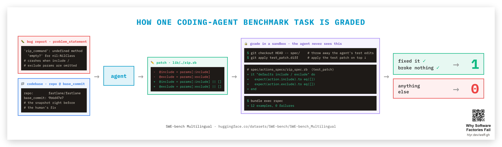</div>

**Aside** - Benchmarks are not verifiers - in fact they have to be held out from each other (don't train on test, yada yada) - I primarily mean this to convey the shape of "judging the quality of a coding agent trace" and its limitations.

How the model got to a correct answer doesn't matter. If the tests pass, we win, but there is **no penalty** for eroding codebase maintainability.

<h3><blockquote>there is no penalty for eroding codebase maintainability</blockquote></h3>

That's how you get try catches around everything:

<div align="center">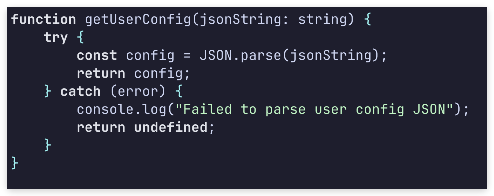</div>

And lazy type casts that undermine the whole benefit of having a type system in the first place

<div align="center">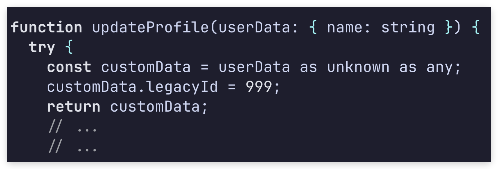</div>

## Verifying quality is orders of magnitude harder than "did the tests pass"

Running the tests gets you a clean pass or fail in ~seconds. That's why RL can run millions of loops to optimize each model generation.

But the cost function of bad architecture is measured in weeks, months, maybe even years. It happens the first time someone opens that file for a one-line change and realizes they can't make it in one line -- that someone vibed this a little too hard, and now we have to make the same edit in eleven places and hope nothing quietly breaks three files over. 

<div align="center">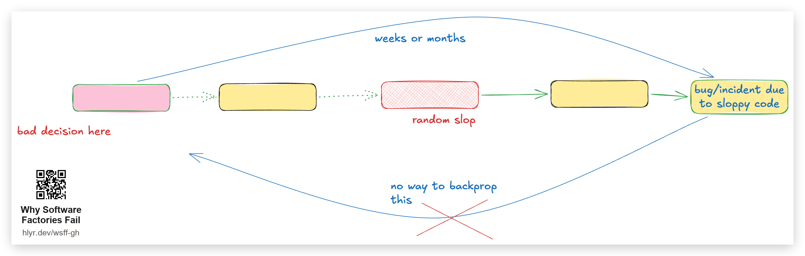</div>

<h3><blockquote>Tests give you feedback in seconds, but the cost function of bad architecture is measured in weeks, months, maybe even years</blockquote></h3>

<div align="center">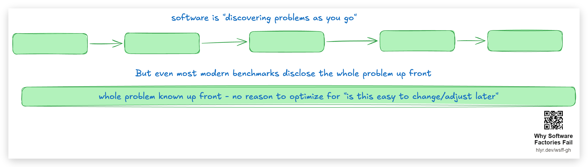</div>


Bad design is the one thing today's benchmarks can't evaluate. And I know, I know, RL != Benchmarks, but if this was solved in RL, I'm pretty sure it would start to show up in how our benchmarks are designed too. 

In any case, I personally don't trust any improvements on today's benchmarks as an indicator that the models are suddenly good at not slopping up your codebase.

## The frontier is getting better, slowly

Of course lots of smart folks are working on this. My point is not that it can't be done, it's that [the hype is outrunning the discipline](https://www.youtube.com/watch?v=c35YoMdnI78).

A few efforts I think are pointed the right way:

- [SWE-Marathon](https://www.swe-marathon.org/) (Abundant AI): ~400-hour tasks like "clone all of Excel, every feature" -- with a compound reward channel instead of a single pass/fail bit
- [DeepSWE](https://deepswe.datacurve.ai/blog/deepswe) (Datacurve): big tasks on OSS repos that were never actually built in the real world, so by construction they can't already be sitting in the training set (solves contamination, but not quality)
- [Frontier Code](https://cognition.com/blog/frontier-code) (Cognition): multi-PR tasks, and a clever move that evaluates quality deterministically -- it penalizes the model for writing tests that don't fail on the pre-patch code (if you've never heard about [mutation testing](https://en.wikipedia.org/wiki/Mutation_testing) you are in for a fun ride[^5]).  It also **runs a judge model over the diff checking code-quality rules**.

<div align="center">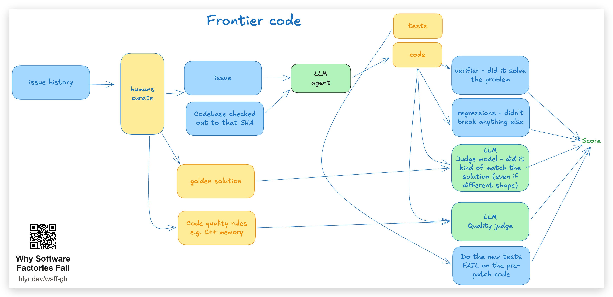</div>

But a model judging quality can only go so far.

In fact, it's not hard to imagine that if a model could reliably tell good code from bad, it might have written the good version to begin with. RL needs a fast+reliable oracle, and we don't yet have one for maintainability


<h3><blockquote>if a model could reliably tell good code from bad, it might have written the good version to begin with, but maintainability has no fast oracle, so we can't reward for it during RL</blockquote></h3>

Of course, more review agents and more tokens do help -- they raise the floor, catching the dumb stuff. 

But they don't move the ceiling, because the ceiling is whatever we managed to teach the model in RL, and good design is the thing we still don't know how to teach it.

So I still wouldn't bet my codebase on any of these. But they're the first evals I've seen even trying to score maintainability instead of stopping at pass/fail.

**Aside** Maybe a future model just gets this and we can stop. If you want to yolo prompts until GPT-7 ships and find out, be my guest -- but bitter lesson be damned, we've got problems to solve now, and I'm gonna walk through how we do that.

## Turning the lights back on

For now, the judge is you -- so we're gonna put the code review back:

<div align="center">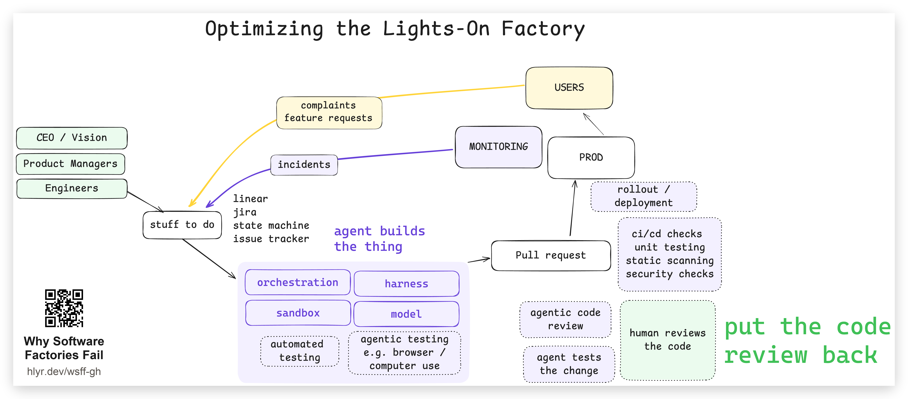</div>

We're gonna embrace that same thing we've been doing since before AI, which is to do [a little bit of planning up front](#front-loading-alignment), to reduce the odds of a long and difficult review.

We're gonna find leverage, and we're gonna use AI to help with this, across 4 phases:

- Product Requirements
- System Architecture
- Program Design
- Vertical Slices

### Product review

Everything starts with a product review: a short doc that pins down *what* we're building and *why*. The goal is to be able to take two sentences or a long voice note ramble and turn it into something semi-structured.

First, we align on the **problem to solve** -- the actual user pain, in the user's terms. Second, **what success looks like** -- what can we read after shipping to decide the thing was worth building. Ideally this is a user outcome like "can do XYZ workflow in less time" or "reaches onboarding milestone ABC earlier". Sometimes it's lower level like an error rate or a latency number, sometimes just "the support tickets about X stop." 

We try to keep this pretty grounded in the product space, not the technical. As someone who lives with one foot in the product world and one foot in the tech, I often find myself drifting into the technical details here. When that happens, I try to just jot it down for later phases and get back to what the user actually experiences. If tech decisions are blocking product decisions, then we commit what we have and get into the architecture or do more [prototype research on what's feasible](https://www.youtube.com/watch?v=Zx_GOhGik0o).

And since most of this is about what the user sees, I don't describe it -- I mock it up. A rough HTML mockup of the actual screen settles an argument that three paragraphs would only prolong.

Here's a real one in progress -- the doc pins down the feature with a JSON outline, then two rough HTML mockups of the actual screens (click to zoom in):

| 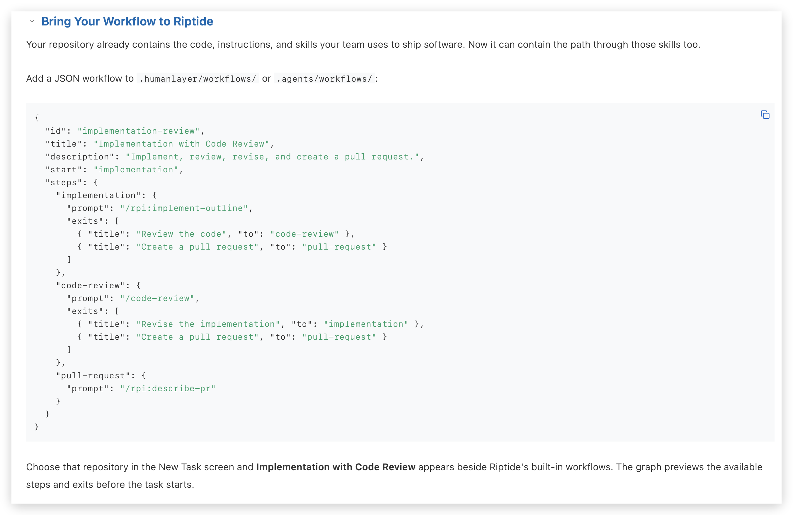 | 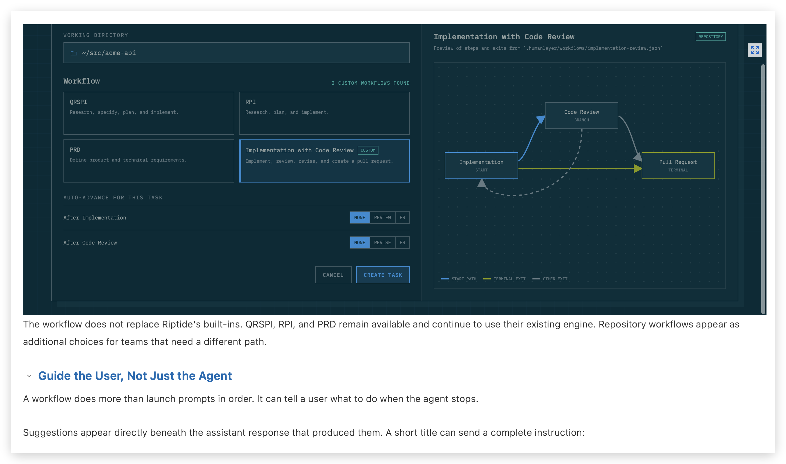 | 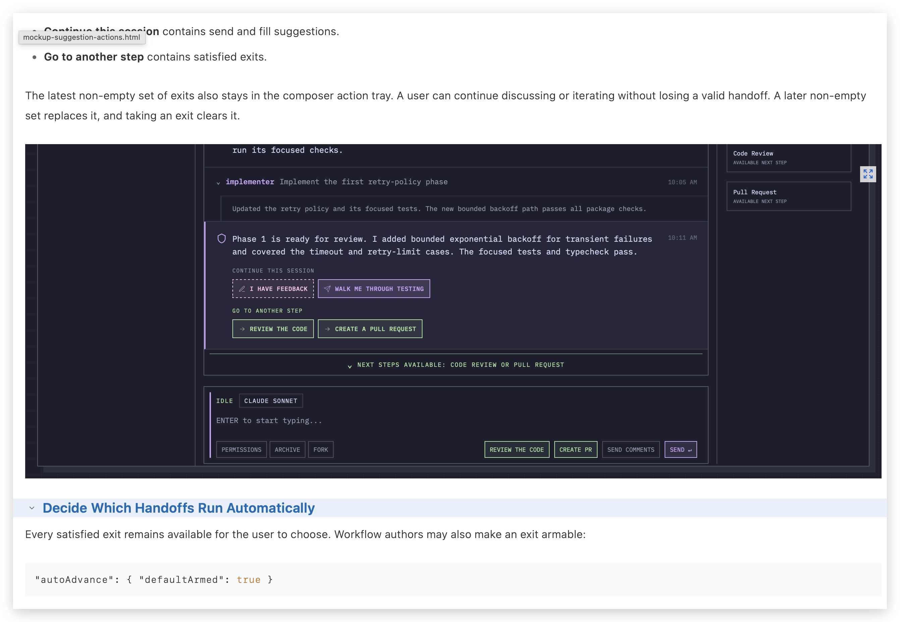 |
|---|---|---|

Of course, not everything gets a product review. A copy tweak, a one-off script, a bug with an obvious repro -- we still just oneshot those straight to the agent. This is for the changes where an agent misunderstanding our intent is expensive.

For this and all docs in the series, we do author-opt-in reviews. If you wanna save time during review, you pick the person who would review the PR, and run through the product/tech specs with them, either async via doc comments (we dogfood humanlayer for this, but you can just as easily do this in github/notion/plannotator/etc).

### System architecture

Once the product review is settled, we do system architecture. This is not particularly novel and is something even vibe coders are starting to swear by. 

<h3><blockquote>If you wanna save time during review, you pick the person who would review the PR, and run through the product/tech specs with them before you get to the coding part</blockquote></h3>

In this phase we align on how the services, endpoints, schemas, queues, and stores talk to each other, without getting into the details of [program design](#program-design). To maximize human<>agent communication bandwidth, we make heavy use of visualizations here - for example sequence diagrams:

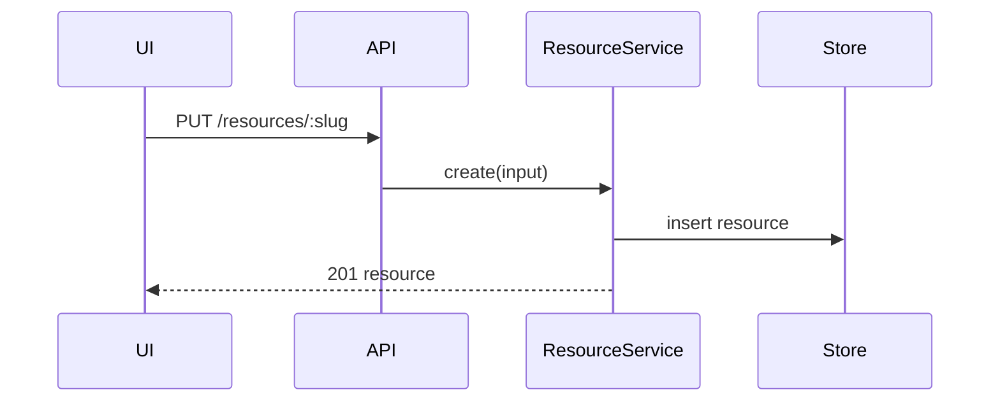
```mermaid
sequenceDiagram
  participant UI
  participant API
  participant ResourceService
  participant Store
  UI->>API: PUT /resources/:slug
  API->>ResourceService: create(input)
  ResourceService->>Store: insert resource
  ResourceService-->>UI: 201 resource
```

Contract / endpoint shapes:

```text
PUT /api/resources/:slug
  request:  { destination: string }
  response: { resource: Resource }
```

Data models and transformations:

```sql
-- new tables
CREATE TABLE resource (
  slug         TEXT PRIMARY KEY,
  destination  TEXT NOT NULL,
  created_at   TIMESTAMPTZ NOT NULL DEFAULT now()
);

-- new query shapes
-- SELECT ... FROM ...
```

Mermaid is fine here but it can sometimes be overkill and sometimes lure you into a false sense that you are aligned. Architecture is fairly high leverage and there's a lot of potentially-bad model tics that you can head off during this phase. But it is insufficient to produce high-quality code. For that we need **program design**.

### Program design

After architecture we do this thing that I think is criminally underemphasized in agentic coding: **program design**.

Most people assume that once the architecture is right, the model can just cook. You can go ahead and do this, but you might not like what you get back. 

But what I see working well is that before anyone (human or agent) writes the implementation, we go a level down from architecture into the **shape of code**: the types, the method signatures, the program layout, and the call stacks.

The first version of our program design skill sucked. It was hard to read, it was exhausting. We tried mermaid, which has its place, but what we **actually love** are light visualizations in pseudocode:

**Call-stack trees**, for any orchestration or control-flow change. Use diff syntax when the interesting part is what's changing:

```diff
 entrypoint
   runCommand
+    handleCreateResource
+      ResourceClient.create(input)
+        POST /resources
+      renderResult
-    legacyCreateFlow
```

[Dillon Mulroy](https://x.com/dillon_mulroy/status/2059985696148849025) talks about using call graphs as part of his planning process, and I think that's exactly right.

<div align="center"><a href="https://x.com/dillon_mulroy/status/2059985696148849025">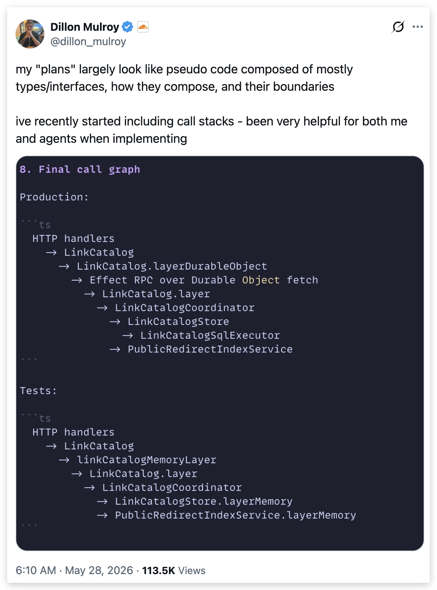</a></div>

**File-tree diffs** - so you can stay in touch with the layout of your codebase and where stuff lives

```diff
 src
 └── resource
+    ├── resource-client.ts      # NEW - wraps API contract calls
+    ├── resource-client.test.ts # NEW - covers request/response mapping
~    └── resource-route.ts       # MODIFIED - wires create action into UI
```

**Types and method signatures** for the key new functions -- the stuff that's too internal for an architecture doc but that an agent might still get wrong 

```ts
interface Item {
  id: ItemId
  parentId: ItemId | null
  // ...
}

interface Cursor {
  position: ItemId
  direction: 'up' | 'down'
  // ...
}

resolveTarget(items: Item[], cursor: Cursor) -> ItemId | null
```


None of these take long to produce (the model drafts them, you argue with it), and every one of them is a decision you'd otherwise be making implicitly during code review -- at the most expensive possible time to change your mind.

### Vertical slices

Next we love doing what I call "vertical slices" - Matt Pocock and I had a [chat about vertical slices or "tracer bullets" on a live stream back in January 2026](https://www.youtube.com/live/NKu3T9FUjmU?si=6BGnZLOkmuIPTjzh&t=2230) - this is also referred to as [tracer bullets](https://basecamp.com/shapeup/3.2-chapter-11#integrate-one-slice)

Models love what I call "horizontal plans" - doing things in stack-order:

1. Database Migrations
2. Service Layer
3. API 
4. Frontend

https://github.com/user-attachments/assets/f9cf7cb7-3baf-48e2-a5dc-59b5fffab614

In practice, what this means is there's no real way to "touch" the solution as you're going. You can test things with code, but for almost any feature I've ever built, reading the tests was a start but pulling something up in a browser, or hitting it with curl while I was working was always a frequent part of the workflow. 

Before AI, it was rare for anyone to write 2000+ lines of code or even 500 lines of code without checking **something** along the way.

It took me a while to notice the difference in what I was used to - when I wrote code before AI, I would always start in the middle and work outwards. Vaguely:

1. Create API contract and serve mock data, test with curl
2. Create frontend to consume mock data, iterate+polish in browser
3. Wire API to services layer (services serves mock data/behavior)
4. Add database migrations, wire services to database
5. Add a bunch of business logic
6. Add a bunch of error handling

And I'd be testing/iterating/polishing at each step. 

https://github.com/user-attachments/assets/62e73eb1-1298-4684-8308-12ab87c21654

If I care about the code a lot or skeptical about the model's ability to do good work in this part of the codebase, I'm reviewing the code at each step too. Checking 100-200 lines and resteering is a lot cheaper 

Most frontier models won't design a plan like this without human steering, and it's hard to generalize per codebase or even per task, so I prefer to stay in the loop here. Trust me. If I could [outsource the thinking](https://www.arthropod.software/p/vibe-coding-our-way-to-disaster#:~:text=The%20methodology%20I%27ve%20outlined%20goes%20beyond%20productivity%20with%20AI%20tools.%20At%20its%20core%2C%20it%20maintains%20the%20discipline%20and%20thoughtfulness%20that%20creates%20maintainable%2C%20understandable%20systems.%20It%20recognizes%20that%20the%20hard%20work%20of%20thinking%20can%27t%20be%20outsourced%20to%20AI%2C%20only%20amplified%20by%20it.) here, I would.

### 30 minutes of planning saves hours of review

And so we have some steps that I would argue that humans need to be in the loop for, if you want to maintain a near-human level of quality without slaving over mountains of slop code trying to clean it up after the fact. (i.e. you actually wanna go fast)

1. Product Design
2. System Architecture
3. Program Design
4. Vertical Slices

Obviously we don't do this whole process for everything we ship (see [the 80/20 rule, below](#the-8020-rule-in-ai-coding-leverage)). I would guess the distribution is roughly:

- ~40% of tasks get oneshot or oneshot w/ 1-2 rounds of light feedback
- for medium tasks, we do product/system design all in one plan document, and don't bother breaking the work into phases
- for large things, we do all the steps. we'll skip the product part for things where it doesn't make sense like big refactors.

And in most cases, I'll send off a model to do 1-3 slices at a time, and review the code as I go. It's a lot easier to resteer early on, whether it's the internals or the actual functionality, than to end up on the other side of 2k+ lines of code with no idea what's broken.

## You probably feel like you have too many pull requests

You don't have too many PRs. You have too many bad PRs.

We've all reviewed a lot of PRs that needed rework, since long before AI. 

But a great PR is a joy to review. You're scrolling through every file, the code is clean, it follows all your decisions/discussions/hard-won opinions about how software should be.

On the other hand, if a Pull Request needs even 20% rework (and that's generous, I'd say most AI oneshot PRs trend closer to 50%), that's both an **intellectual burden** and an **emotional burden** on both the submitter **and** the reviewer. (Even if the submitter is an AI, someone probably kicked off this work or vibe polished the AI result or at the very least, cares about the outcome).

To spare you time (we're almost at the end), I rambled more about this in a side quest: ["where does the time go"](./side-quests/where-does-the-time-go.md)

## a theory of constraints (2026 edition)

It's easy to be a little bummed by the core thesis here: "for now we're stuck reading the code".

I was pretty excited for a world where we could just ask for things and let the models cook and not read the code and get beautiful production software that evolves over time and doesn't go to shit.

But what I've done my best to lay out here are nothing but constraints. Models are good at some things, not so good at others. How do you optimize your process in light of those constraints?

<h3><blockquote>Models are good at some things, not so good at others. How do you optimize your process in light of those constraints?</blockquote></h3>

It is possible you are too busy trying to move 10-100x faster and trying to convince yourself code quality doesn't matter any more, when you could embrace the constraints and move 2-3x faster, safely.

My kind of closing advice here is basically:

1. Learn the constraints well, develop intuition by working with models a lot
2. Optimize systems within the arena of these constraints
3. Seek leverage
4. Read the dang code

That's it. If you wanna stay for the pitch, keep scrolling I guess. I hope this helps you avoid disaster or at least that you had fun watching some cute little animations. 

**Thanks for reading**

🫡 -dex

* * *

### PS We're obsessed with this

We're building [humanlayer.com](https://humanlayer.com), an agentic IDE and collaboration platform to help you move 2-3x faster while maintaining a human (or pretty-dang-close-to-human) level of code quality.

We're building towards two ideas: "building blocks for your software factory" and "better verifiers for software maintainability" (perhaps better models even).

HumanLayer is free for small teams of up to 3 people, and if you want help getting started, you can come hang in our [discord](https://hlyr.dev/discord) or drop us a line at [founders@humanlayer.dev](mailto:founders@humanlayer.dev)

A quick shout out to @calvinfo for inspiration, to my cofounder @0xBlacklight, to @swyx and the team at @aiDotEngineer for giving us an arena and to all our incredible customers, investors, friends, and family cheering us on.

If you wanna learn more, I basically won't shut up about this, so you can find all the links from this post as well as a few other projections of the material into podcasts, long form whiteboard, etc, below.


### PPS Other resources

Podcasts and Articles:
- [Dex and Gergely talk context engineering and software factories on The Pragmatic Engineer - July 2026](https://www.youtube.com/watch?v=Usufn8IQJgw)
- [Dex and Matt Pocock talk evergreen ai coding advice (and ralph loops) - January 2026](https://www.youtube.com/watch?v=NKu3T9FUjmU)

AI That Works Episodes:
- [Benchmarks prove nothing](https://www.youtube.com/watch?v=X5mI1ZVxaIc)
- [Product Specs for AI Coding](https://www.youtube.com/watch?v=0LPBw3NO3Jc)
- [Learning Tests for better backpressure](https://www.youtube.com/watch?v=Zx_GOhGik0o)
- [Applying 12-factor agents principles to AI coding](https://www.youtube.com/watch?v=qgAny0sEdIk)

Links from this post:
- [Why Software Factories Fail keynote — AI Engineer World's Fair 2026](https://hlyr.dev/wsff-live)
- [StrongDM's lights-off software factory](https://factory.strongdm.ai)
- [OpenAI: Harness Engineering (Feb 2026)](https://openai.com/index/harness-engineering/)
- [Ryan Lopopolo on Symphony (talk, Apr 2026)](https://www.youtube.com/watch?v=am_oeAoUhew)
- [Mario at AI Engineer Europe: "Building pi in a world of slop"](https://www.youtube.com/watch?v=RjfbvDXpFls)
- [FT: Amazon outages from coding-agent mishaps](https://www.ft.com/content/00c282de-ed14-4acd-a948-bc8d6bdb339d)
- [Matt Pocock: codebases falling apart](https://www.youtube.com/watch?v=3MP8D-mdheA)
- [Faros AI: the AI acceleration whiplash report](https://www.faros.ai/research/ai-acceleration-whiplash)
- [Advanced Context Engineering for Coding Agents (talk 8/25)](https://hlyr.dev/ace)
- [No Vibes Allowed (talk 11/25)](https://hlyr.dev/nva)
- [Everything We Got Wrong About RPI (talk 3/26)](https://hlyr.dev/qrspi-mlops)
- [Awesome-RLVR - Reinforcement Learning resources](https://github.com/opendilab/awesome-RLVR)
- [Advanced Context Engineering for Coding Agents (write-up)](https://github.com/humanlayer/advanced-context-engineering-for-coding-agents/blob/main/ace-fca.md)
- [12-Factor Agents](https://hlyr.dev/12fa)
- [Addy Osmani on vibe-coding vs. maintenance](https://x.com/addyosmani/status/2066595308629594363)
- [NATO Software Engineering Conference, 1968](http://homepages.cs.ncl.ac.uk/brian.randell/NATO/nato1968.PDF)
- [DoD DevSecOps Reference Design (PDF)](https://dodcio.defense.gov/Portals/0/Documents/Library/DevSecOpsReferenceDesign.pdf)
- [Ramp's coding-agent platform](https://infoq.com/news/2026/01/ramp-coding-agent-platform/)
- [Stripe: Minions, one-shot end-to-end coding agents](https://stripe.dev/blog/minions-stripes-one-shot-end-to-end-coding-agents)
- [WorkOS: Project Horizon](https://workos.com/blog/project-horizon)
- [Brex (Latent Space)](https://www.latent.space/p/brex)
- [Dan Shapiro: the five levels to the software factory](https://www.danshapiro.com/blog/2026/01/the-five-levels-from-spicy-autocomplete-to-the-software-factory/)
- [Simon Willison on StrongDM's software factory](https://simonwillison.net/2026/Feb/7/software-factory/)
- ["Boil the ocean"](https://garryslist.org/posts/boil-the-ocean)
- [Shotgun surgery (refactoring.guru)](https://refactoring.guru/smells/shotgun-surgery)
- [John Ousterhout — A Philosophy of Software Design](https://web.stanford.edu/~ouster/cgi-bin/aposd.php)
- [Robert C. Martin — Clean Code](https://www.oreilly.com/library/view/clean-code-a/9780136083238/)
- [Martin Fowler — Refactoring](https://martinfowler.com/books/refactoring.html)
- [aider](https://aider.chat)
- [cline](https://cline.bot)
- [codebuff](https://codebuff.com)
- [SWE-Agent paper (2024)](https://arxiv.org/abs/2405.15793)
- [OpenAI Codex talk (Nov)](https://www.youtube.com/watch?v=wVl6ZjELpBk)
- [Calvin French-Owen — AI Council talk](https://www.youtube.com/watch?v=q-ntX4DLW_c)
- [SWE-bench Multilingual (dataset)](https://huggingface.co/datasets/SWE-bench/SWE-bench_Multilingual)
- [AIE Worlds Fair 2026 - The Great Loops Debate ("the hype is outrunning the discipline")](https://www.youtube.com/watch?v=c35YoMdnI78)
- [SWE-Marathon (Abundant AI)](https://www.swe-marathon.org/)
- [DeepSWE (Datacurve)](https://deepswe.datacurve.ai/blog/deepswe)
- [Frontier Code (Cognition)](https://cognition.com/blog/frontier-code)
- [Mutation testing (Wikipedia)](https://en.wikipedia.org/wiki/Mutation_testing)
- [Dillon Mulroy on call graphs in planning](https://x.com/dillon_mulroy/status/2059985696148849025)
- [Dex × Matt Pocock: vertical slices / tracer bullets (livestream, Jan 2026)](https://www.youtube.com/live/NKu3T9FUjmU?si=6BGnZLOkmuIPTjzh&t=2230)
- ["The hard work of thinking can't be outsourced" (Jake Nations)](https://www.arthropod.software/p/vibe-coding-our-way-to-disaster)


[^1]: The loop, as an AI technique, was more or less discovered by an [alleged goat farmer](https://ghuntley.com/ralph/) on a remote island off the coast of Australia.

[^1b]: i've been doing this for what feels like too long, but it's widely accepted that the big uptick was in december 2025 going into the new year

[^3]: yes of course you can get gpt-5.5 xhigh to do BRILLIANT refactors. But you had to tell it to do that. And to tell it to do that you had to understand your codebase well enough to know it needed doing. We're here talking about why lights-off wont work.

[^5]: back at sprout social in ~2013, my boss told me about a game he liked to play where you see how many lines of code you can delete from the python monolith without any of the thousands of unit tests failing

[^6]: yes i chose that word and typed it out one character at a time because it's appropriate here. if you thought the code was bad, don't even get me started on trash agent prose
